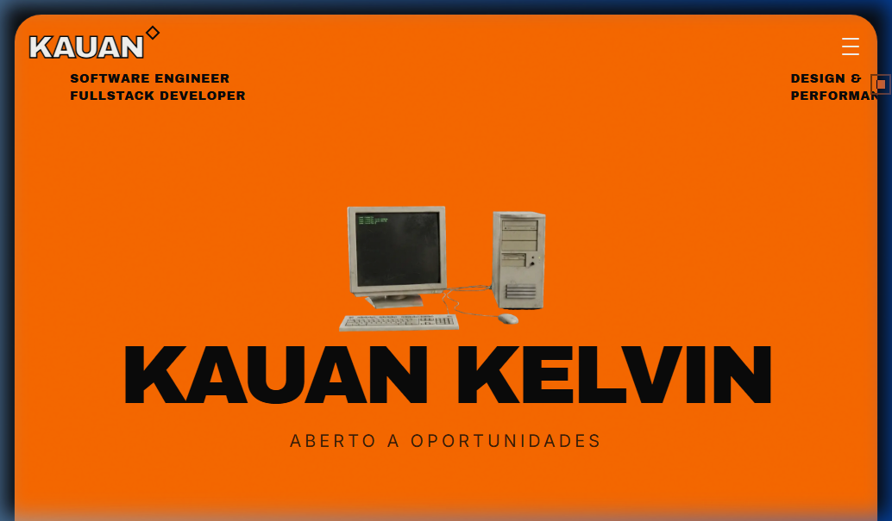
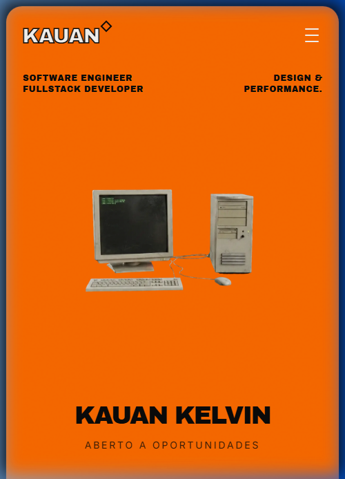

<div align="center">

```
██████╗  ██████╗ ██████╗ ████████╗███████╗ ██████╗ ██╗     ██╗ ██████╗
██╔══██╗██╔═══██╗██╔══██╗╚══██╔══╝██╔════╝██╔═══██╗██║     ██║██╔═══██╗
██████╔╝██║   ██║██████╔╝   ██║   █████╗  ██║   ██║██║     ██║██║   ██║
██╔═══╝ ██║   ██║██╔══██╗   ██║   ██╔══╝  ██║   ██║██║     ██║██║   ██║
██║     ╚██████╔╝██║  ██║   ██║   ██║     ╚██████╔╝███████╗██║╚██████╔╝
╚═╝      ╚═════╝ ╚═╝  ╚═╝   ╚═╝   ╚═╝      ╚═════╝ ╚══════╝╚═╝ ╚═════╝
```

### ─────── PORTIFÓLIO· 3D INTERACTIVE · MEUS PROJETOS · PERFORMANCE-FIRST ───────

<br />

[](https://pagespeed.web.dev/analysis/https-kauankelvindev-vercel-app/ofskc5x1t0?form_factor=desktop)
[](https://kauankelvindev.vercel.app/)
[](./LICENSE)

<br />

**"Feito para ser lembrado."**

<br />

[](https://kauankelvindev.vercel.app/)

<br />

</div>

---

## 📸 PREVIEW

<div align="center">
  <table>
    <tr>
      <td width="60%">
        
      </td>
      <td width="40%">
        
      </td>
    </tr>
  </table>

  <!-- substitua pelo seu GIF aqui:  -->
</div>

---

## ◼ O QUE É ISSO?

Um portfólio construído contra o padrão. Enquanto todo mundo utiliza templates minimalistas e gradientes suaves, este projeto abraça o **Neo-Brutalismo**: tipografia pesada, sombras duras, bordas marcadas e contrastes vibrantes — sem abrir mão de nenhum décimo de performance.

A pergunta que guiou cada decisão de design foi simples: **"Quem vê vai lembrar?"**

---

## 🛠 TECH STACK

| Camada | Tecnologia | Por Quê? |
| :--- | :--- | :--- |
| **Framework** | Next.js 16 (App Router) | SEO, Server Actions e performance SSR. |
| **3D Engine** | React Three Fiber | Three.js com ergonomia React para cenas interativas. |
| **Styling** | Tailwind CSS v4 | CSS-first, zero runtime e design tokens rápidos. |
| **Animações** | Framer Motion | Transições fluidas e controle de Motion Accessibility. |
| **Linguagem** | TypeScript Strict | Código auto-documentado e livre de bugs comuns. |
| **Deploy** | Vercel Edge | Latência mínima e CI/CD robusto. |

---

## ⚡ PERFORMANCE & ACESSIBILIDADE

Ter 3D no browser e ainda assim carregar instantaneamente exige engenharia de ponta:

- **Adaptive Rendering**: O sistema detecta hardware low-end e reduz automaticamente a carga do 3D (DPR, luzes e materiais).
- **Motion Control**: Suporte nativo a `prefers-reduced-motion` para usuários sensíveis a movimento.
- **Draco Compression**: Modelos `.glb` comprimidos em até 90% para download ultra-rápido.
- **Zero CLS**: Fontes e assets carregados sem saltos de layout através de loaders customizados.

### Lighthouse Scores
| Métrica | Score |
| :--- | :--- |
| **Performance** | 🟢 100 |
| **Acessibilidade** | 🟢 100 |
| **Boas Práticas** | 🟢 100 |
| **SEO** | 🟢 100 |

---

## 🚀 RODANDO LOCALMENTE

```bash
# 1. Clone o repositório
git clone https://github.com/kauankelvin7/portfolio-dev.git

# 2. Acesse a pasta
cd portfolio-dev

# 3. Instale as dependências
npm install

# 4. Rode o ambiente de desenvolvimento
npm run dev
```

Abra **[kauankelvindev.vercel.app](https://kauankelvindev.vercel.app/)** no seu navegador para ver a versão em produção.

---

## 📂 ESTRUTURA

```bash
portfolio-neobrutalista/
├── app/                # Rotas, layouts e metadados SEO
├── components/
│   ├── 3d/             # Cenas Three.js e BootLoaders
│   ├── ui/             # Design System (Neobrutalist components)
│   └── sections/       # Seções principais da Home
├── public/
│   ├── models/         # Assets 3D (.glb)
│   └── screenshots/    # Assets visuais do README
└── hooks/              # Lógica de Device Capability e Reduced Motion
```

---

## 📩 CONTATO

- **LinkedIn**: [Kauan Kelvin](https://www.linkedin.com/in/kauan-kelvin)
- **Email**: [kelvinkauan722@gmail.com](mailto:kelvinkauan722@gmail.com)
- **GitHub**: [github.com/kauankelvin7](https://github.com/kauankelvin7)

---

<div align="center">
  <p>Design & Code by <strong>Kauan Kelvin</strong> © 2026</p>
</div>
